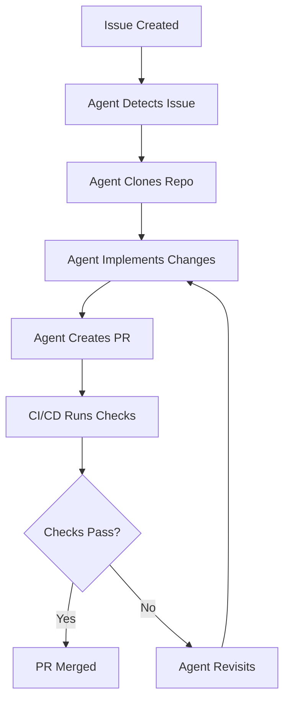

# auto-pr-test

Test repo for auto PR agent workflow. This repository is used to validate and demonstrate automated pull request creation and management using AI-powered agents. It serves as a sandbox for testing end-to-end CI/CD workflows, issue-driven development, and autonomous code modification pipelines.

## Workflow Diagram

